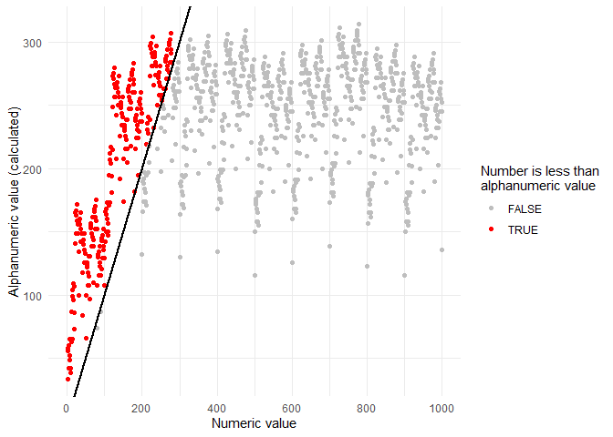

Quick Riddler Fun
================
Seth Caldwell
10/01/2020

From Leonard Cohen comes a puzzle at the intersection of language and
mathematics:

In Jewish study, “Gematria” is an alphanumeric code where words are
assigned numerical values based on their letters. We can do the same in
English, assigning 1 to the letter A, 2 to the letter B, and so on, up
to 26 for the letter Z. The value of a word is then the sum of the
values of its letters. For example, RIDDLER has an alphanumeric value of
70, since R + I + D + D + L + E + R becomes 18 + 9 + 4 + 4 + 12 + 5 + 18
= 70.

But what about the values of different numbers themselves, spelled out
as words? The number 1 (ONE) has an alphanumeric value of 15 + 14 + 5 =
34, and 2 (TWO) has an alphanumeric value of 20 + 23 + 15 = 58. Both of
these values are bigger than the numbers themselves.

Meanwhile, if we look at larger numbers, 1,417 (ONE THOUSAND FOUR
HUNDRED SEVENTEEN) has an alphanumeric value of 379, while 3,140,275
(THREE MILLION ONE HUNDRED FORTY THOUSAND TWO HUNDRED SEVENTY FIVE) has
an alphanumeric value of 718. These values are much smaller than the
numbers themselves.

If we consider all the whole numbers that are less than their
alphanumeric value, what is the largest of these numbers?

``` r
library(dplyr)

rate <- setNames(as.list(1:26), letters)

pricer <- function(x, rate) {
  rate[[x]]
}

converter <- function(x, rate) {
  x <- english::english(x)
  x <- stringr::str_remove_all(x, "( )|(\\-)")
  x <- unlist(stringr::str_split(x, ""))
  sum(purrr::map_dbl(x, pricer, rate))
}

num_vals <- 1:1000
alph_vals <- purrr::map_dbl(num_vals, converter, rate)

df <- tibble(
  num_vals = num_vals,
  alph_vals = alph_vals
) %>%
  mutate(num_less = num_vals < alph_vals)
```

``` r
library(ggplot2)

ggplot(df, aes(x = num_vals, y = alph_vals, color = num_less)) +
  geom_point() + 
  scale_x_continuous(breaks = seq(0, 1000, by = 200)) +
  scale_color_manual(values = c("grey", "red")) +
  geom_abline(slope = 1, intercept = 0, size = 1) +
  theme_minimal() +
  labs(x = "Numeric value",
       y = "Alphanumeric value (calculated)",
       color = "Number is less than\nalphanumeric value")
```

<!-- -->

We can see that once we get to two hundred, at each hundred we have
local minima. The max and second max alphanumeric values are 777 and
727. It seems that at each hundred, twenty-seven and seventy-seven
provide the largest alphanumeric value on top of the rest\! Fun stuff.

And the largest numeric value that is less than its alphanumeric
calculated value is 279.
